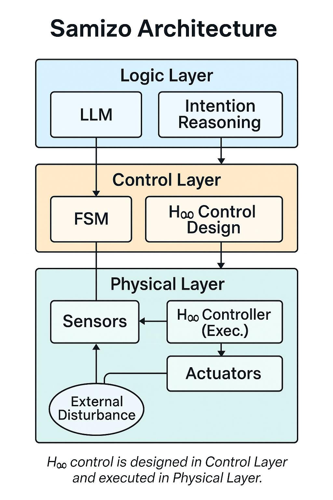

# 🧠 AITL: All-in-Theory Logic (Samizo Architecture)

**AITL (All-in-Theory Logic)** proposes a structured and theory-driven architecture for intelligent systems.  
At its core lies the **Samizo Architecture**, which decomposes AI into three layers:

- 🧠 Logic Layer: reasoning, hypothesis generation (LLM-powered)
- 🔁 Control Layer: deterministic execution via FSM (Finite State Machine)
- ⚙️ Physical Layer: robust real-world control using H∞ theory

This separation of logic, control, and physics enables scalable, interpretable, and resilient AI systems.

---

## 🚀 From Theory to Practice

The architecture is not just conceptual. We provide:

- ✅ PoC implementations with FSM × LLM × physical control  
- ✅ AITL-HX: a space robotics prototype using H∞-control and alpha-particle resistance  
- ✅ Educational materials covering architecture, signal flow, and embedded systems

See full structure: [AITL/README.md](./README.md)  
Architecture diagram:  

---

## 🧱 System Highlights

| Layer        | Role                                     |
|--------------|------------------------------------------|
| Logic Layer  | Intent understanding, generative planning (via LLM) |
| Control Layer| Finite State Machine for safe, deterministic behavior |
| Physical Layer | Sensor integration and robust control (e.g. H∞)   |

---

## 🎓 Educational Path

We are preparing:

- `Fundamental_of_AITL_Architecture/`: Core materials with implementation cases  
- `Edusemi-AITL`: Semiconductor-to-AI curriculum (planned)  
- `AITL-Lab`: FSM / LLM exercises with feedback visualization (planned)

Explore: [Education/README.md](./Education/README.md)

---

## 🌍 Application Scenarios

- 🛰️ AITL-HX: Radiation-tolerant AI robot for space  
- 🤖 Yorisoi: Elderly care robot with emotional dialogue  
- 🛡️ SkyShield: Disaster response system with sensor fusion  
- 🏭 EcoSmartEdge: Industrial optimization via structured AI

See [Application_Expansions/](./Application_Expansions/) for details.

---

## 🤝 Open Collaboration

This is an open-source project under the MIT License.  
We welcome:

- Contributions to PoC implementation, control models, and hardware design  
- Use in university courses or technical education  
- Collaborative research (space, robotics, defense, AI architecture)

Author: **Shinichi Samizo**  
GitHub: [Samizo-AITL](https://github.com/Samizo-AITL)  
Contact: `shin3t72@gmail.com`

---

📘 For Japanese readers, see: [README.md](./README.md)
