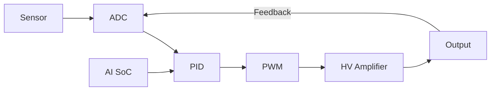
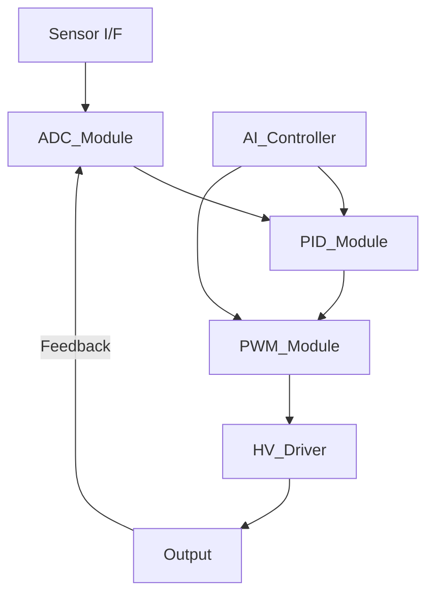

# 📘 AITL System Implementation Guide  
*A practical and theoretical guide to AI-based feedback control systems based on AITL principles.*

---

## 1. 🎯 はじめに（目的と背景）

本ドキュメントは、AITL（All-in-Theory Logic）構想に基づき、AI制御SoCを中心とした**フィードバック制御システムの設計・実装手順**を、以下の3段階で整理したものです：

1. システム構成図（全体構想）
2. モジュール実装図（SoC設計視点）
3. AITL実装手順（理論 → モジュール → 統合）

---

## 2. 🧭 システム構成図（全体構想）

### Mermaid図：


---

## 　3. 🧩 モジュール実装図（SoC設計視点）



   ### モジュール概要：

| モジュール名     | 役割                             | 実装形式（例）   |
|------------------|----------------------------------|------------------|
| `Sensor_IF`      | センサからの物理信号取り込み     | AMS設計 / IF回路 |
| `ADC_Module`     | アナログ→デジタル変換           | SAR/ΔΣ ADC       |
| `PID_Module`     | 誤差に基づく制御信号生成         | デジタル制御回路 |
| `PWM_Module`     | パルス変調信号生成               | タイマ・PWM制御  |
| `HV_Driver`      | 高電圧駆動用アンプ制御           | HV AMS設計       |
| `AI_Controller`  | 学習・最適化、パラメータ調整     | NN推論・強化学習 |
| `OutputBlock`    | アクチュエータ駆動、出力制御     | 実世界への作用   |

---

## 4. 🛠️ AITL実装手順（理論 → モジュール → システム）

| ステップ | 内容                                | 実装場所（例）     |
|---------|-------------------------------------|--------------------|
| ① 理論整理 | 制御理論（PID）、AIモデル設計          | `theory/`          |
| ② モジュール設計 | 各ブロックをHDL/Cで記述                 | `modules/`         |
| ③ 統合設計 | Top設計、バス/信号接続                 | `soc/`             |
| ④ テストベンチ | 各モジュール・統合レベルで検証         | `test/`            |
| ⑤ AI統合 | AI推論ブロックとの連携（強化学習など）  | `ai/`              |
| ⑥ PoC構築 | 実機での評価（FPGA、マイコン等）         | `PoC/`             |

---

## 5. 🚀 応用と展開

- **教育**：`edusemi`と連携し、理論から実装までを一貫指導
- **開発**：PoC開発キットの核として展開可能
- **研究**：AITL理論の応用検証（制御・推論の融合）

---

## 6. 📎 付録（参考：構成図表示Tips）

### Mermaid使用方法（GitHub上表示対応済）

```markdown
```mermaid
flowchart LR
  A --> B
\```
